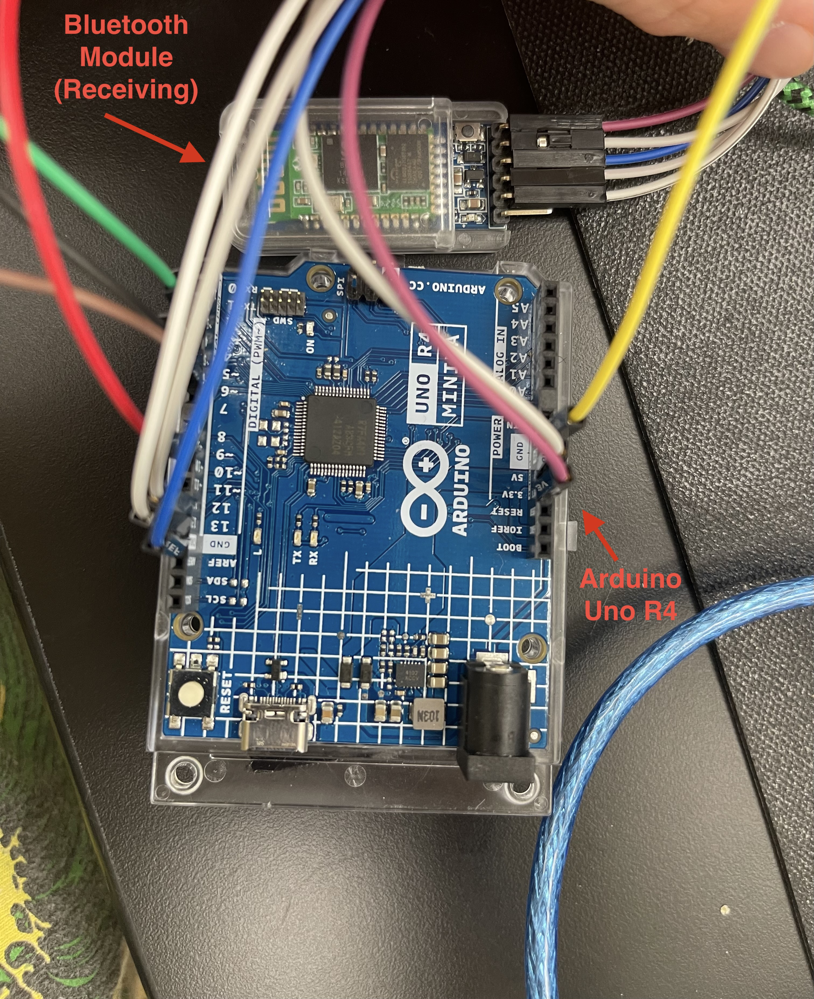
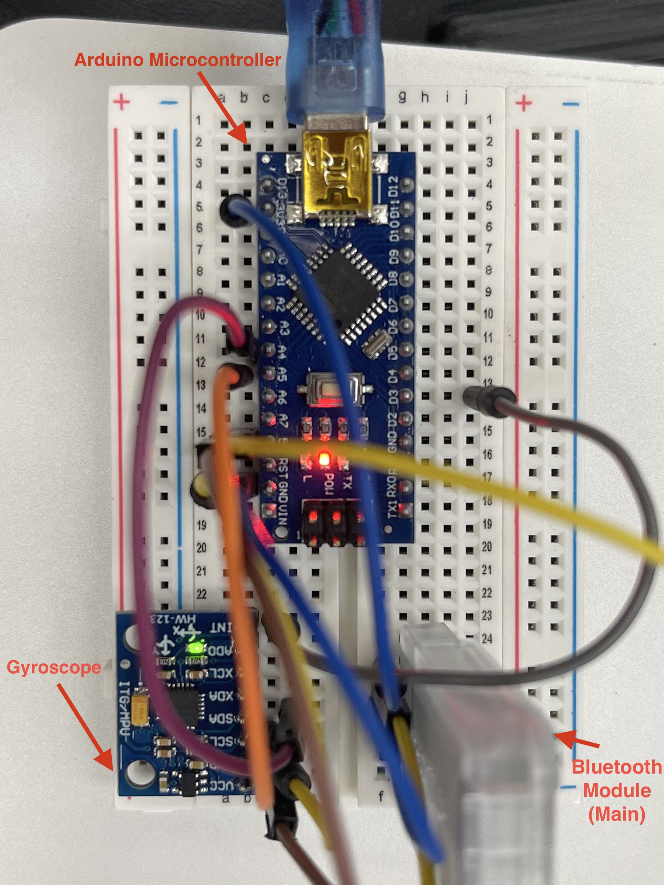

# Gesture Controlled Robot
I built a gesture controlled robot car, that moves when you move your hand. The Gyroscope on your hand connects with the car using bluetooth connected to an Arduino Uno. The Arduino connects to a motor controller which controls the motors.


```HTML 
<!--- This is an HTML comment in Markdown -->
<!--- Anything between these symbols will not render on the published site -->
```

| **Engineer** | **School** | **Area of Interest** | **Grade** |
|:--:|:--:|:--:|:--:|
| Filip D | Leigh High School | Bio-Engineering | Incoming Sophomore

**Replace the BlueStamp logo below with an image of yourself and your completed project. Follow the guide [here](https://tomcam.github.io/least-github-pages/adding-images-github-pages-site.html) if you need help.**


  
# Final Milestone

**Don't forget to replace the text below with the embedding for your milestone video. Go to Youtube, click Share -> Embed, and copy and paste the code to replace what's below.**

<iframe width="560" height="315" src="https://www.youtube.com/embed/F7M7imOVGug" title="YouTube video player" frameborder="0" allow="accelerometer; autoplay; clipboard-write; encrypted-media; gyroscope; picture-in-picture; web-share" allowfullscreen></iframe>

For your final milestone, explain the outcome of your project. Key details to include are:
- What you've accomplished since your previous milestone
- What your biggest challenges and triumphs were at BSE
- A summary of key topics you learned about
- What you hope to learn in the future after everything you've learned at BSE


# Second Milestone

**Don't forget to replace the text below with the embedding for your milestone video. Go to Youtube, click Share -> Embed, and copy and paste the code to replace what's below.**

<iframe width="560" height="315" src="https://www.youtube.com/embed/y3VAmNlER5Y" title="YouTube video player" frameborder="0" allow="accelerometer; autoplay; clipboard-write; encrypted-media; gyroscope; picture-in-picture; web-share" allowfullscreen></iframe>

For your second milestone, explain what you've worked on since your previous milestone. You can highlight:
- Technical details of what you've accomplished and how they contribute to the final goal
- What has been surprising about the project so far
- Previous challenges you faced that you overcame
- What needs to be completed before your final milestone 

# First Milestone

**Don't forget to replace the text below with the embedding for your milestone video. Go to Youtube, click Share -> Embed, and copy and paste the code to replace what's below.**

<iframe width="560" height="315" src="https://www.youtube.com/embed/CaCazFBhYKs" title="YouTube video player" frameborder="0" allow="accelerometer; autoplay; clipboard-write; encrypted-media; gyroscope; picture-in-picture; web-share" allowfullscreen></iframe>

My project is a gesture controlled robot and my first milestone is building the body. The parts of the body are the wheels, the two metal body parts, the motors, and the H bridge. I put all those parts together, and now my milestone is done. The biggest challenge was screwing all the screws because some of them came out, and I had to screw in both levels of the chassis, and the wheel axels. But now everything is assembled and im ready to pursue my second milestone which is the electrical things.


# Schematics 





# Code


```c++
#include <BLEDevice.h>
#include <BLEServer.h>
#include <BLEUtils.h>
#include <BLE2902.h>


int IN1 = 9;
int IN2 = 8;
int IN3 = 7;
int IN4 = 6;
int ENA = 12;
int ENB = 10;

const bool DEBUG = true;

const char* BLE_NAME = "GestureCar";


// so these are much smaller numbers than the Dabble version used.
const float TILT_THRESH  = 0.60;   // tilt needed before anything moves
const int DRIVE_SPEED = 250;   // tilt for full speed (~35 degrees)
const int TURN_SPEED = 160;

// Speed limits (0-255)
const int MAX_SPEED = 250;   
const int MIN_SPEED = 60;    

const bool INVERT_LEFT     = false;
const bool INVERT_RIGHT    = false;
const bool INVERT_THROTTLE = false;
const bool INVERT_STEERING = false;


const unsigned long PACKET_TIMEOUT_MS = 800;

#define NUS_SERVICE_UUID "6E400001-B5A3-F393-E0A9-E50E24DCCA9E"
#define NUS_RX_UUID      "6E400002-B5A3-F393-E0A9-E50E24DCCA9E"  // phone -> board
#define NUS_TX_UUID      "6E400003-B5A3-F393-E0A9-E50E24DCCA9E"  // board -> phone

volatile float  gAccelX = 0, gAccelY = 0;
volatile bool   gConnected = false;
volatile unsigned long gLastPacketMs = 0;

BLECharacteristic* txChar = nullptr;


uint8_t  pktBuf[24];
uint8_t  pktLen = 0;

float threshold = 0.05;


int expectedPacketLen(char type) {
  switch (type) {
    case 'A': return 15;  // accelerometer (x, y, z)
    case 'G': return 15;  // gyro
    case 'M': return 15;  // magnetometer
    case 'L': return 15;  // location
    case 'Q': return 19;  // quaternion
    case 'B': return 5;   // button
    case 'C': return 6;   // color
    default:  return -1;
  }
}

bool crcOk(const uint8_t* buf, uint8_t len) {
  uint8_t sum = 0;
  for (uint8_t i = 0; i < len - 1; i++) sum += buf[i];
  return (uint8_t)(~sum) == buf[len - 1];
}

float floatAt(const uint8_t* buf, int offset) {
  float f;
  memcpy(&f, buf + offset, 4);   
  return f;
}

void feedByte(uint8_t b) {
  
  if (pktLen == 0) {
    if (b != '!') return;
    pktBuf[pktLen++] = b;
    return;
  }

  pktBuf[pktLen++] = b;

  if (pktLen == 2) {
    if (expectedPacketLen((char)pktBuf[1]) < 0) {
      pktLen = 0;   
    }
    return;
  }

  int want = expectedPacketLen((char)pktBuf[1]);
  if (pktLen >= want) {
    if (crcOk(pktBuf, want) && pktBuf[1] == 'A') {
      gAccelX = floatAt(pktBuf, 2);
      gAccelY = floatAt(pktBuf, 6);
      
      gLastPacketMs = millis();
    }
    pktLen = 0;
  }

  if (pktLen >= sizeof(pktBuf)) pktLen = 0;   // safety
}


class RxCallbacks : public BLECharacteristicCallbacks {
  void onWrite(BLECharacteristic* c) override {
    std::string v = c->getValue();
    for (size_t i = 0; i < v.length(); i++) feedByte((uint8_t)v[i]);
  }
};


class ServerCallbacks : public BLEServerCallbacks {
  void onConnect(BLEServer* s) override {
    gConnected = true;
    gLastPacketMs = millis();
  }
  void onDisconnect(BLEServer* s) override {
    gConnected = false;
    gAccelX = 0;
    gAccelY = 0;
    BLEDevice::startAdvertising();   // let it reconnect
  }
};


void driveMotor(int pwmPin, int in1, int in2, float value, bool invert) {
  if (invert) value = -value;

  if (fabs(value) < 0.01) {
    digitalWrite(in1, LOW);
    digitalWrite(in2, LOW);
    analogWrite(pwmPin, 0);
    return;
  }

  bool forward = (value > 0);
  digitalWrite(in1, forward ? HIGH : LOW);
  digitalWrite(in2, forward ? LOW  : HIGH);

  int speed = MIN_SPEED + (int)(fabs(value) * (MAX_SPEED - MIN_SPEED));
  analogWrite(pwmPin, constrain(speed, 0, 255));
}

void stopMotors() {
  digitalWrite(IN1, LOW);
  digitalWrite(IN2, LOW);
  digitalWrite(IN3, LOW);
  digitalWrite(IN4, LOW);
  analogWrite(ENA, 0);
  analogWrite(ENB, 0);
}

float axisToUnit(float v) {
  if(v > TILT_THRESH) return 1.0;
  if(v < -TILT_THRESH) return -1.0;

  return 0.0;
}


void setup() {
  Serial.begin(115200);

  pinMode(ENA, OUTPUT);
  pinMode(IN1, OUTPUT);
  pinMode(IN2, OUTPUT);
  pinMode(ENB, OUTPUT);
  pinMode(IN3, OUTPUT);
  pinMode(IN4, OUTPUT);
  stopMotors();

  BLEDevice::init(BLE_NAME);
  BLEServer* server = BLEDevice::createServer();
  server->setCallbacks(new ServerCallbacks());

  BLEService* service = server->createService(NUS_SERVICE_UUID);

  BLECharacteristic* rxChar = service->createCharacteristic(
      NUS_RX_UUID,
      BLECharacteristic::PROPERTY_WRITE | BLECharacteristic::PROPERTY_WRITE_NR);
  rxChar->setCallbacks(new RxCallbacks());

  txChar = service->createCharacteristic(
      NUS_TX_UUID, BLECharacteristic::PROPERTY_NOTIFY);
  txChar->addDescriptor(new BLE2902());

  service->start();

  BLEAdvertising* adv = BLEDevice::getAdvertising();
  adv->addServiceUUID(NUS_SERVICE_UUID);
  adv->setScanResponse(true);
  BLEDevice::startAdvertising();

  Serial.println("Advertising as GestureCar.");
  Serial.println("Bluefruit Connect -> connect -> Controller -> Accelerometer");
}

void loop() {
  bool live = gConnected &&
              (millis() - gLastPacketMs < PACKET_TIMEOUT_MS);
  
  if (!live) {
    stopMotors();
    delay(20);
    return;
  }

  float throttle = gAccelY;   // tilt forward/back
  float steering = gAccelX;   // tilt left/right

  static unsigned long lastDbg = 0;
  if(millis() - lastDbg > 300){
    lastDbg = millis();
    Serial.print(" x="); Serial.print(steering, 3);
    Serial.print(" y="); Serial.println(throttle, 3);
  }

  if (fabs(throttle) > threshold || fabs(steering) > threshold) {
    if (INVERT_THROTTLE) throttle = -throttle;
    if (INVERT_STEERING) steering = -steering;

    float left  = throttle + steering;
    float right = throttle - steering;

    float peak = max(fabs(left), fabs(right));
    if (peak > 1.0) {
      left  /= peak;
      right /= peak;
    }

 
    // Left Driver = ENA, IN1, IN2
    driveMotor(ENA, IN1, IN2, left,  INVERT_LEFT);
    // Right Driver = ENB, IN3, IN4
    driveMotor(ENB, IN3, IN4, right, INVERT_RIGHT);
  } else {
    stopMotors();
  }
  
  delay(10); 
}

```

# Bill of Materials

| **Part** | **Note** | **Price** | **Link** |
|:--:|:--:|:--:|:--:|
| Arduino Nano ESP32| Microcontroller | $19.30 | <a href="https://store-usa.arduino.cc/products/nano-esp32-with-headers?utm_source=google&utm_medium=cpc&utm_campaign=US-Pmax&gad_source=1&gad_campaignid=21317508903&gbraid=0AAAAACbEa8495Cjbem1beiV2598e-NST7&gclid=CjwKCAjwj7HTBhBiEiwA8s35OqpQHvwXaUFhnHCSP6Uqrj1pd16D5lqWVEWMdvKmvLJBcFI_ZPnwOhoConYQAvD_BwE"> Link </a> |
| L298N Motor Drive Controller | Motor Driver | $6.99 | <a href="https://www.amazon.com/dp/B014KMHSW6?lv=shuf&channelId=500&plpRedirect=mhFallback"> Link </a> |
| Yellow TT Motor | Motor | $4 | <a href="[https://www.amazon.com/Arduino-A000066-ARDUINO-UNO-R3/dp/B008GRTSV6/](https://www.amazon.com/dp/B07L881GXZ?lv=shuf&channelId=500&plpRedirect=mhFallback)"> Link </a> |
| 4WD Omni-wheel Robot Car Metal Chassis | Body of Robot | $39.99 | <a href="[https://www.amazon.com/Arduino-A000066-ARDUINO-UNO-R3/dp/B008GRTSV6/](https://tscinbuny.com/products/tscinbuny-4wd-omni-wheel-robot-car-metal-chassis-for-arduino-robotic-project?srsltid=AfmBOop6Gvt8zAMGuKzlqsgk_bIsCMRnhd3i3FTzRNGI2_1eoBUjmyByTyw)"> Link </a> |


